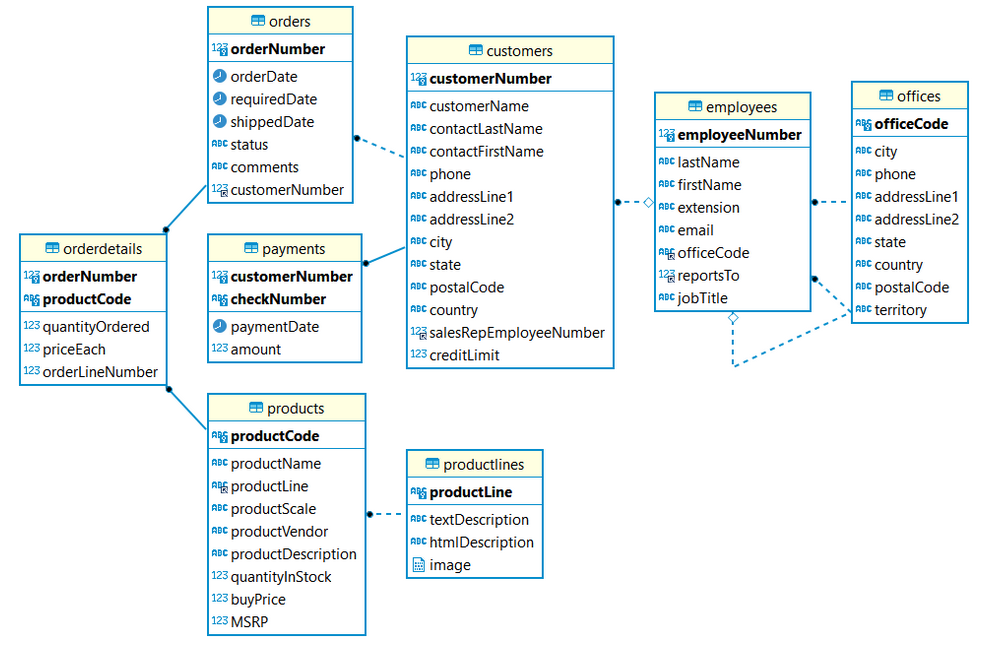
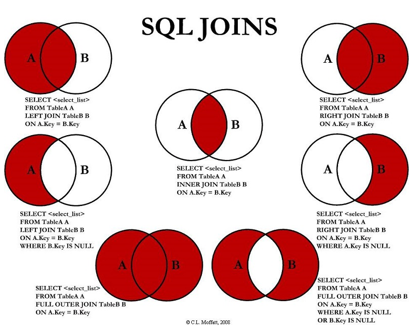
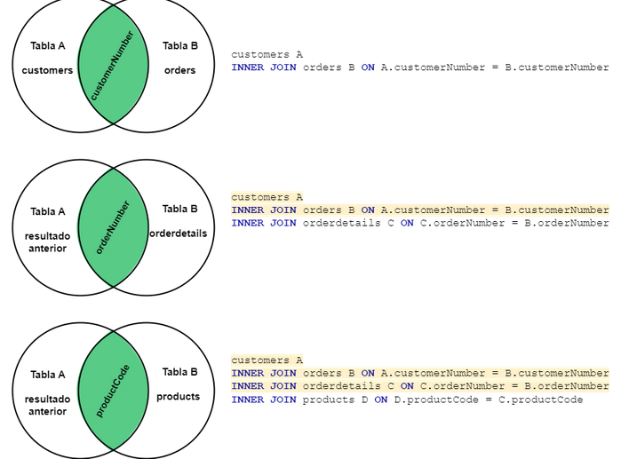

# Lo mismo pero más bonito [aquí](https://tech.io/playgrounds/123318/sql-facilito)

Tomando como ejemplo la base del archivo mysqlsampledatabase.sql vemos las siguientes sentencias.

## Where
Define una condición (o varias) que debe cumplirse para que los datos sean devueltos. Los operadores utilizados en la cláusula WHERE (o cualquier condición definida en la cláusula) no tienen efecto en los datos almacenados en las tablas. Sólo afectan a los datos devueltos cuando se invoca la vista. Se puede incluir en una instrucción SELECT, UPDATE o DELETE.

### Operadores de Comparación

__Típicos (=, !=, <, <=, >, >=)__
- AND: Para unir dos condiciones, ambas deben ser verdaderas.
- OR: Para unir dos condiciones, una condición debe ser verdadera.
- IS NULL: Para obtener las filas donde X columna tiene valor null.
- BETWEEN: para identificar un rango de valores.
- NOT: Para negar una condición.
- LIKE: es posible especificar valores que son solamente similares a los valores almacenados.
-   -   Signo de porcentaje (%): representa cero o más caracteres desconocidos.
-   -   Guión bajo (_): representa exactamente un carácter desconocido.
-   IN: permite determinar si los valores en la columna especificada de una tabla están contenidos en una lista definida o contenidos dentro de otra tabla.
-   EXISTS: Está dedicado únicamente a determinar si la subconsulta arroja alguna fila o no.

_Ejemplo:_
SELECT CustomerNumber
FROM customers
WHERE customerNumber BETWEEN 121 AND 471
AND (customerName LIKE 'A%'
    OR customerName LIKE '_A%')
AND addressLine1 IS NOT NULL
AND addressLine2 IS NULL
AND creditLimit > 0
AND postalCode IN ('4110', '51247');

## Subconsultas o Subquerys
Proporcionan una forma de acceder a datos en múltiples tablas con una sola consulta. Puede agregarse a una instrucción SELECT, INSERT, UPDATE o DELETE para permitir a esa instrucción utilizar los resultados de la consulta arrojados por la subconsulta. La subconsulta es esencialmente una instrucción SELECT incrustada que actúa como una puerta de entrada a los datos en una segunda tabla.

Se pueden en dos categorías generales:

- Las que pueden arrojar múltiples filas
- Las que pueden arrojar solamente un valor

Subconsulta que retorna múltiples filas.

_Ejemplos:_

SELECT * 
FROM customers
WHERE customerNumber BETWEEN 100 AND 500
AND (customerName LIKE 'A%'
    OR customerName LIKE '_A%')
AND addressLine1 IS NOT NULL
AND addressLine2 IS NULL
AND customerNumber IN (
	SELECT DISTINCT customerNumber
	FROM orders 
	WHERE orderDate >= '2005-01-01'
);

Subconsultas que retornan solamente un valor:

SELECT * 
FROM customers
WHERE creditLimit > (
	SELECT MAX(amount)
	FROM payments
);

SELECT *, (SELECT MAX(amount) FROM payments) MaxPayment
FROM customers;

El resultado de la subconsulta tambien puede ser utilizado como que fuera una tabla asignandole un alias y seleccionar datos de ese resultado.

SELECT *
FROM (
	SELECT customerNumber, CustomerName
	FROM customers
    WHERE customerNumber BETWEEN 100 AND 500
	AND (customerName LIKE 'A%'
		OR customerName LIKE '_A%')
	AND addressLine1 IS NOT NULL
	AND addressLine2 IS NULL
) Subquery;

Una subconsulta tambien puede tener mas subconsultas, como una cadena.
> Al utilizar una varias subconsultas es importante ser cuidados ya que puede llegar a afectar significativamente el rendimiento del query.

SELECT *
FROM (
    SELECT customerNumber, CustomerName
    FROM customers
    WHERE creditlimit < (
        SELECT MAX(amount) 
        FROM payments
    )
) Subquery2;

## Funciones de agregación
Realizan operaciones sobre un grupo o un set de datos. Comúnmente son utilizadas con la cláusula GROUP BY para generar grupos y resultados sobre esos grupos.
Algunas funciones comunes

    AVG: Para promediar valores
    COUNT: Para contar registros
    COUNT(DISTINCT): Para contar registros unicos.
    MAX: Devuelve el valor máximo.
    MIN: Devuelve el valor mínimo.
    SUM: Para sumar valores.
    STD: Devuelve la desviación estándar.
    JSON_ARRAYAGG(): Agrupa un set de datos en un JSON array.
    JSON_OBJECTAGG(): Una fila de datos es retornada en formato JSON.

_Ejemplos:_

Seleccionamos el total de registros en la tabla customers, para obtener otra métrica, solo cambiamos el COUNT por la función que necesitemos.

SELECT COUNT(*)  
FROM customers;

Seleccionamos el total de registros en la tabla customers, pero en lugar de un total general, es el total agrupado por el campo country.

SELECT country, COUNT(*)  
FROM customers  
GROUP BY country;

### GROUP BY

Es posible utilizar más de una función de agregación en un mismo query. Todos los campos individuales que están junto a la función de agregación en la clausula SELECT debe ir tambien en la clausula GROUP BY.

SELECT country, AVG(creditLimit), MIN(creditLimit), MAX(creditLimit)  
FROM customers  
GROUP BY country;

SELECT country, state, city, AVG(creditLimit), MIN(creditLimit), MAX(creditLimit)  
FROM customers  
GROUP BY country, state, city;  

Identificar duplicados con COUNT

La función COUNT puede ser utilizada para contar duplicados.

SELECT COUNT(firstName), COUNT(DISTINCT firstName)  
FROM employees;

SELECT firstName, COUNT(firstName)  
FROM employees  
GROUP BY firstName  
HAVING COUNT(firstName) > 1;

### HAVING

A diferencia de la cláusula WHERE, la cláusula HAVING se refiere a grupos, no a filas individuales. Se aplica a los resultados después de haberse agrupado (en la cláusula GROUP BY). Tiene la ventaja de permitir el uso de funciones establecidas tales como AVG o SUM, que no se pueden utilizar en la cláusula WHERE a menos que se coloquen dentro de una subconsulta.

SELECT country, state, city, AVG(creditLimit), MIN(creditLimit), MAX(creditLimit)  
FROM customers  
WHERE customerNumber BETWEEN 100 AND 500  
AND creditLimit > 100000  
GROUP BY country, state, city  
HAVING MIN(creditLimit) >= 100000;

### ORDER BY

Toma la salida de la cláusula SELECT y ordena los resultados de la consulta de acuerdo con las especificaciones dentro de la cláusula ORDER BY. Se especifica una o más columnas y las palabras clave opcionales ASC o DESC (una por columna). Si no se especifica la palabra clave, setoma ASC.

    ASC: Orden ascendente
    DESC: Orden descendente.

SELECT country, state, city, AVG(salesRepEmployeeNumber), MIN(creditLimit)  
FROM customers  
WHERE customerNumber BETWEEN 100 AND 500  
AND creditLimit > 0  
GROUP BY country, state, city  
HAVING MIN(creditLimit) >= 100000  
ORDER BY country, state DESC, city ASC, MIN(creditLimit);

### Objetos JSON
Transformamos la data en un objeto Json, llave:valor, puede ser agrupada en un solo json o un json de jsons.

SELECT JSON_OBJECT('Name', customerName, 'Country', country, 'City', city) Json  
FROM customers  
ORDER BY customerName;

SELECT country, JSON_OBJECTAGG(customerName, city) Json  
FROM customers  
GROUP BY country  
ORDER BY country;

SELECT JSON_ARRAYAGG(JSON_OBJECT('Name', customerName, 'Country', country, 'City', city)) Json  
FROM customers;

# Joins
Un componente importante de cualquier base de datos relacional es la correlación que puede existir entre dos tablas cualesquiera. En SQL podemos unir las tablas en una instrucción. Una operación join es una operación que hace coincidir las filas en una tabla con las filas de manera tal que las columnas de ambas tablas puedan ser colocadas lado a lado en los resultados de la consulta como si éstos vinieran de una sola tabla.

    INNER JOIN: Devuelve registros que tienen valores coincidentes en ambas tablas
    LEFT JOIN: Devuelve todos los registros de la tabla de la izquierda y los registros coincidentes de la tabla de la derecha.
    RIGHT JOIN: Devuelve todos los registros de la tabla de la derecha y los registros coincidentes de la tabla de la izquierda.
    CROSS JOIN (OUTER JOIN o FULL OUTER JOIN): Combina todas las filas de la tabla A con todas las filas de la tabla B.
    SELF JOIN: Aplica las reglas de los joins anteriores, solo que se realiza con la misma tabla.

## Ejemplo INNER JOIN

Leer los clientes que tienen ordenes, si un cliente no tiene ninguna orden, no estará en este resultado.

A: customers  
B: orders

SELECT C.customerNumber, C.customerName, O.orderNumber, O.orderDate  
FROM customers C  
INNER JOIN orders O ON C.customerNumber = O.customerNumber;

Otra forma de escribirlo:

SELECT C.customerNumber, C.customerName, O.orderNumber, O.orderDate  
FROM customers C  
JOIN orders O ON C.customerNumber = O.customerNumber;

Sin el join: 

SELECT C.customerNumber, C.customerName, O.orderNumber, O.orderDate  
FROM customers C, orders O  
WHERE C.customerNumber = O.customerNumber;

A: customers  
B: offices

SELECT C.customerNumber, C.customerName, O.officeCode, O.addressLine1  
FROM customers C  
INNER JOIN offices O ON C.country = O.country  
	AND O.state = C.state  
    AND O.city = C.city;  

## Ejemplo LEFT JOIN

Leer todos los clientes, si los clientes tienen ordenes entonces aparecerán esos datos en el resultado, sino, apareceran como null.

A: customers  
B: orders

SELECT C.customerNumber, C.customerName, O.orderNumber, O.orderDate  
FROM customers C  
LEFT JOIN orders O ON C.customerNumber = O.customerNumber;

Leer todos los clientes, que no tienen ordenes.

SELECT C.customerNumber, C.customerName, O.orderNumber, O.orderDate  
FROM customers C  
LEFT JOIN orders O ON C.customerNumber = O.customerNumber  
	AND O.orderNumber IS NULL;

## Ejemplo RIGTH JOIN

Leer todos los clientes, si los clientes tienen ordenes entonces aparecerán esos datos en el resultado, sino, apareceran como null.

A: orders  
B: customers

SELECT C.customerNumber, C.customerName, O.orderNumber, O.orderDate  
FROM orders O  
RIGHT JOIN customers C ON C.customerNumber = O.customerNumber;

Leer todos los clientes, que no tienen ordenes.

SELECT C.customerNumber, C.customerName, O.orderNumber, O.orderDate  
FROM orders O  
RIGHT JOIN customers C ON C.customerNumber = O.customerNumber  
	AND O.orderNumber IS NULL;

## Ejemplo CROSS JOIN
El Cross Join multiplica todos los registros de las tablas, duplicandose los datos, cuidado con tablas gigantescas.

Además, no necesita un campo el cual juntar, ya que multiplica toda la tabla.

Leer todos los clientes y todas las ordenes:

A: orders  
B: customers

SELECT C.customerNumber, C.customerName, O.orderNumber, O.orderDate  
FROM customers C  
CROSS JOIN orders O;

Otra forma de hacer un cross join:  

SELECT C.customerNumber, C.customerName, O.orderNumber, O.orderDate  
FROM customers C, orders O;

La combinación anterior excepto la intersección de la tabla customers y orders.

SELECT C.customerNumber, C.customerName, O.orderNumber, O.orderDate  
FROM customers C  
CROSS JOIN orders O  
WHERE C.customerNumber != O.customerNumber;

## Ejemplo SELF JOIN

Leer todas las ordenes y muestra el id de otra orden para para el mismo cliente y misma fecha.

A: orders  
B: orders  

SELECT A.customerNumber, A.orderNumber, A.orderDate, B.orderNumber  
FROM orders A  
LEFT JOIN orders B ON A.customerNumber = B.customerNumber  
	AND A.orderDate = B.orderDate  
	AND A.orderNumber != B.orderNumber;

## Joins con tablas intermediarias
Para obtener la lista de clientes y los productos que ha comprado cada cliente no existe una relación directa entre la tabla customers y products por lo que es necesario hacer los joins con tablas segun el diagrama ER muestra las llaves foraneas (como una cascada) hasta lograr llegar a la tabla de productos. 

SELECT C.customerNumber, C.customerName, P.productCode, P.productName  
FROM customers C  
INNER JOIN orders O ON C.customerNumber = O.customerNumber  
INNER JOIN orderdetails D ON D.orderNumber = O.orderNumber  
INNER JOIN products P ON P.productCode = D.productCode;