# Fundamentos de red para el backend
## Cómo funciona la web
Se entiende la web como el navegar en internet, el descargar datos, el conectarse a un servidor desde una app, ... Porque la web es una parte del internet.

La web funciona en una arquitectura llamada __cliente-servidor__, esta hace referencia a un modelo en el que tenemos una computacodra central a la que otras computadoras se conectan para obtener la información almacenada en esta computadora central. Para comunicar las computadoras clientes con la computadora sevidor utilizamos la red como medio de transporte.

Estas computadoras intercambian paquetes de información entre dos direcciones. A esto lo llamados el __protocolo TCP/IP__. Los mensajes que se envían entre el cliente y el servidor usan el __protocolo HTTP__ para estructurarse. 

El concepto de la arquitectura cliente-servidor describe el modelo de red en el que varias computadoras se comunican entre sí, en este modelo tenemos dos actores principales: el cliente y el servidor. Estos conceptos no representan un equipo en sí, sino una entidad en la red, donde el servidor pueden ser muchas computadoras, y los clientes también pueden ser muchos. 

El objetivo de este modelo es separar las responsabilidades de cómputo entre el servidor y el cliente, por lo que cada computadora podrá ejecutar programas distintos para la operación del negocio.

El servidor actúa como un provedor de servicios, y podemos decir que comparte sus recursos de cómputo con los clientes. Los clienten consumen estos servicios y no comparten su capacidad de cómputo con el servidor.

En esta arquitectura, la comunicación se da utilizando un patrón de intercambio de mensajes llamado _"request-response"_, solicitud-respuesta, donde una computadora(cliente) solicita información y la otra (servidor) responde. El cleinte __siempre__ inicia la solicitud y debe esperar la respuesta del servidor.

Entonces, para que la arquitectura pueda operar bien, se deben establecer reglas para la comunicación, transporte, codificación del mensaje, información que debe enviarse y que debe recibirse entre otros. Para cumplir todos estos requisitos se utlizan protocolos de red, en el caso de la web se usa el modelo _TCP/IP_ y el modelo de comunicación es el _HTTP_.

## Qué es un protocolo de red
Un protocolo es un conjunto de reglas y normas preestablecidas, en el caso de los protocolos de red, sirven para transmitir datos entre dos dispositivos. Para lograrlo, la complejidad de transferecnia de datos se divide en funciones pequeñas y específicas, que suceden en los distitntos niveles de operación de la red. Cada una de estas funciones puede estar resuelta por un protocolo, por lo que podemos concluir que en la comunicación y transferencia de datos entre dispositivos intervienen muchos protocolos distintos.

Escencialmente lo que los protocolos buscan determinar es:
- Cómo estructurar los datos.
- Formato de los datos.
- Qué información enviar.
- Qué hacer en caso de error.

Estos protocolos trabajan en colaboración, como en una fábrica en donde cada protocolo recibe datos, los procesa y los pasa al siguiente protocolo, así hasta llegar a su destino.

## Modelo OSI
Para evitar el caos entre tanto protocolo, se crean modelos conceptuales que ayudan a la organización de los protocolos dependiendo de la tarea que resuelven.

El primer modelo es el __modelo OSI__ que establece un _framework_ o marco de trabajo de 7 capas en el que se puedan organizar los distintos protocolos de red.

Las capas del modelo OSI:

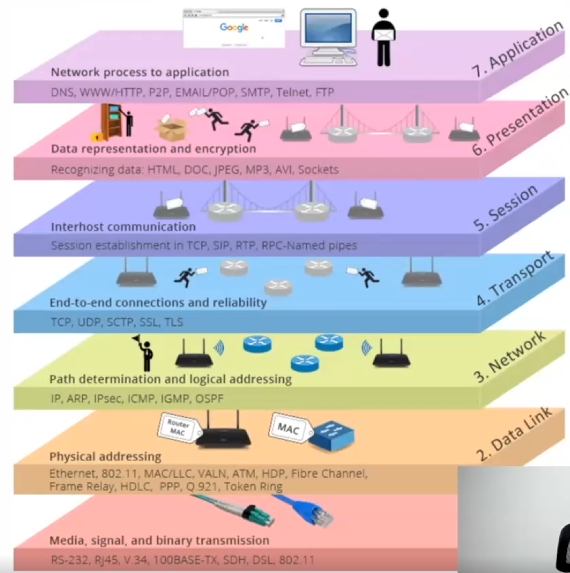
- Capa física
- Capa de enlace de datos (Data Link)
- Capa de red
- Capa de transporte
- Capa de sesión
- Capa de presentación
- Capa de aplicación

El objetivo del modelo OSI es establecer un marco de comunicación y referencia, con el cuál se puedan discutir soluciones y problemas de red, separando la complejidad en 7 distintas capas.

## Modelo TCP/IP
Este modelo también agrupa distintos protocolos y se utiliza para establecer comunicación entre dos dispositivos a través del internet. Se organiza en 5 capas.
- Capa física
- Capa de enlace de datos (data link)
- Capa de red
- Capa de transporte
- Capa de aplicación

Las capas de sesión, presentación y aplicación del modelo OSI se agrupan en la capa de aplicación del modelo TCP/IP. En algunas referencias, las capas de enlace de datos y física de agrupan en una: la capa de interfaz de red.
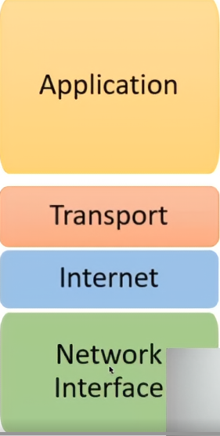

Cada una de estas capas establece responsabilidades distintas necesarias para que la comunicación en el internet sea posible y funcional. 

Ahondando en las capas:
- La capa física hace referencia al médio físico con el cual se moverá la información, cables ethenet, fibra óptica, ... 
- La capa data link es una intermediaria entre la física y de red, se encarga de procesar los paquetes de datos de las capas superiores y transformarlos en bits para que puedan transmitirse por la capa física. (análogo a digital)
- La capa de red. Establece el camino entre dispositivos, así como transformar los datos que vienen de capas superiores en paquetes más pequeños. Los protocolos de la capa de red no incluye los mensajes de confirmación de llegada. Solo los envían
- La capa de transporte: Supervisa el camino de la información; Confirma si el paquete fue recibido o no; Recibir los paquetes y a partir de estos recuperar el mensaje original. Mantener la conexión abierta. 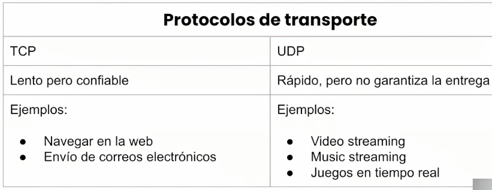
- La capa de aplicación. Es el enlace con la aplicación con la que interactúa el usuario y establece el mensaje para pasar a la capa de transporte. Antes de esta capa, importa un carajo que se está mandando es solo información, es en esta capa donde toma sentido la información enviada. 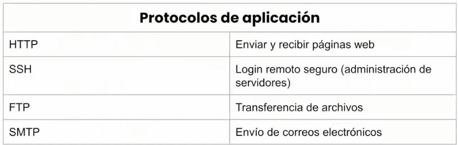

En internet se transfieren muchos mensajes con distintos propósitos que son posibles gracias a que existen más de un protocolo de aplicación. Para enviar dicha información se utilizarán uno de dos principales protocolos de transportte, TCP y UDP quienes se encargan de supervisar el envío y comunicación a ambos dispositivos. El protocolo IP es el protocolo encargado de que el mensaje pase de un lado a otro hasta llegar al destinatario y para hacerlo usa direcciones IP.

Un mensaje producido por la capa de aplicación no se envía en un solo grupo, se envía por partes. Cada parte llega al destinatario con el protocolo IP y el protocolo de transporte reúne las partes para volver a formar el mensaje.

La web es sólo una aplicación de internet, también podemos enviar correos, conectar servidores y para cada aplicación se usa un protocolo distinto.

El protocolo para la web es el protocolo HTTP, el que establece cómo se deberá formular una solicitud a un servidor, que luego será enviada usando el protocolo TCP, usando una dirección IP hasta llegar al servidor. Eventualmento, el servidor podra responder con otro mensaje HTTP que será devuelto usando la misma conexión TCP, con la IP del cliente y llegará hasta tu el navegador para que este la interprete. 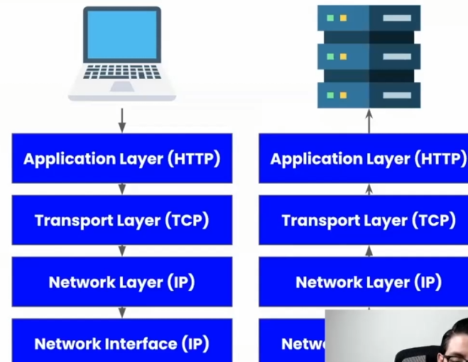

Los protocolos de la capa de aplicación "interactuan con el usuario", esto entre comillas ya que no es directo, sino a través de un software, como lo puede ser un navegadore web, chrome, safari, firefoz, opera, ...

Otro protocolo clave de la web en la capa de aplicación es el __protocolo DNS__, muy similar a las capas del protocllo HTTP excepto la capa de aplicación, la arquitectura request-response en la misma. 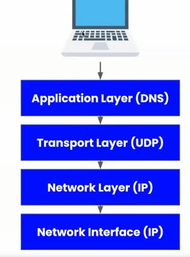

La web requiereque :Usemos el protocolo DNS para obtener una IP; Usar esta IP para identificada para enviar otra petición pero ahora usando el protocolo HTTP.

## Protocolo HTTP (Hyper Text Transfer Protocol)
El protocolo HTTP es el protocolo de la web, se ubica en la capa de aplicación, por lo que podemos pensar en este como la puerta para que nuestro código se comunique con el internet y podamos intercambiar datos. 

Sus características principales son:
- Es simple, puede ser leído por humanos.
- Es extendible. Nuevas funcionalidades pueden ser implementadas usando encabezados. Los __JWT__ es un ejemplo de la extendibilidad, porque no pertenece al HTTP puro.
- No tiene estado, pero si tiene sesiones. Cada mensaje es independiente. No guarda infomación el servidor, en todo caso lo haría la base de datos, pero el servidor no persiste ninguna información. Para mantener un estado por un corto tiempo se usan las sesiones, autorización y autenticación se ven involucrados en este proceso.
- Intercambian información en una capa de transporte de confianza. Como lo es el protocolo TCP. 

### Solicitud HTTP
En la solicitud que va del cliente al servidor podemos encontrar: 
- Versión del protocolo HTTP (porque hay varias)
- URL (Uniform Resourse Locator)
- Método HTTP
- Encabezados HTTP
- Cuerpo HTTP (opcional)

La versión HTTP define qué implementación del protocolo vamos a utilizar, esta versión determina también qué información puedes enviar y cómo se manejará. En la versión HTTP 1, solo se mandaba el path y el verbo.En HTTP 1.1 por cada petición se enlazaba con un protocolo TCP, afectando el rendimiento del servidor por lo que implica abrir una conexión tcp por cada petición. En la versión HTTP 2 con una sola conexión TCP podemos mandar multiples peticiones. En HTTP 3 la diferecnia es la capa de transporte, ya que usa el protocolo _Quic_ 

La URL es un identificador de recursos de internet. Se divide en diferentes partes: El esquema (HTTP o HTTPS), el dominio, el puerto (no siempre aparece, si no aparece es el 80 o 443 respectivamente), el path al archivo del servidor, los parámetros y el ancla o anchor.
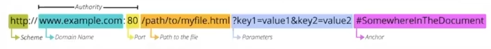

Las URL en el backend nos sirven para identificar la petición del cliente, una imagen, un video, ...

El método HTTP, también conocido como verbo es un identificador para indicarle al servidor que acción espera que realice con el recurso de la URL. Algunos de ellos:
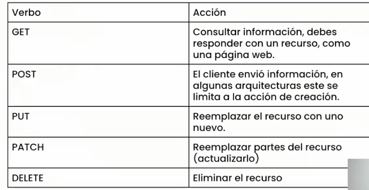 Esta imagen muestra la base de la arquitectura REST

Los navegadores solo pueden enviar dos verbos, GET y POST, algunas arquitecturas como REST los demás verbos se simulan.

Los encabezados HTTP son datos organizados en formato clave/valor arbitrarios, estos nos permite extender la funcionalidad del protocolo. Existen encabezados predefinidos que se envían en cada solicitud y que envían a nuestro servidor información que pueda sernos útil. (user-agent : el navegador donde se realiza la petición, referer: la url de donde ocurre la petición, content-type: que tipo de respuesta se espera del servidor en qué formato debe venir, normalmente es application/json). 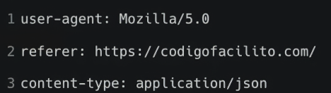

El cuerpo de la petición HTTP puede contener información adicional que enviamos al servidor. Esta información puede enviarse en distintos formatos, apoyándose del encabezado content-type.
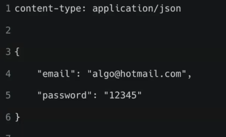

### Respuesta HTTP
En una respuesta HTTP encontramos: 
- Código de estado (status code)
- Encabezados HTTP
- Cuerpo HTTP (opcional)

El código de estado le permite saber al cliente cuál fue el resultado de la petición.  Los códigos de estado se dividen en los siguientes grupos:
- Del 100 al 199 Informativo
- Del 200 al 299 Éxito
- 300 al 399 Redirección
- 400 al 499 Errores del cliente
- 500 al 599 Errores del servidor

Estos códigos dotan de información extra al cliente. No son respuestas automáticas, como backend se le indica al cliente el error del cliente.

Los encabezados tienen la misma forma que en las solicitudes.

En el cuerpo HTTP, aquí es donde iría el html de una página web, el contenido del archivo solicitado y en sí, el contenido que deseamos enviar el cliente.

Ejemplo de una solicitud:
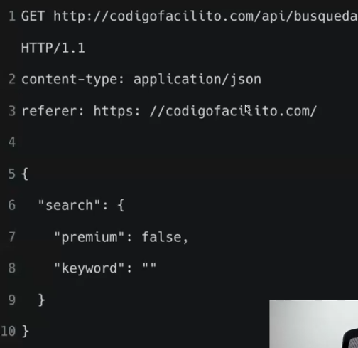

Ejemplo de una respuesta:
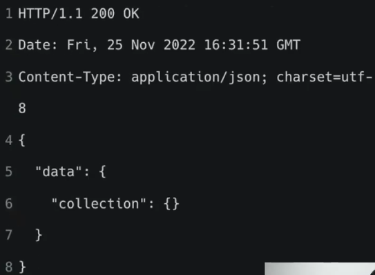

## Herramientas para peticiones HTTP

Existen herramientas para visualizar los vensajes y generarlos. Como __cURL__, __Postman__: Aplicación visual con la que podemos generar solicitudes HTTP utilizando la interfaz gráfica del programa, también podremos visualizar su respuesta. __REST Client para VSC__: Herramienta para crear archivos con la información para generar solicitudes HTTP y correrlas desde VSC, para usarlo, creamos archivos con la extensión .http y dentro se escribe la solicitud, para aprender a usarlo existe la documentación donde especifican la sintaxis.

## Otras herramientas útiles
- Who.is : Web que permite explorar los name servers que se usan con el protocolo DNS, origen del dominio y más.
- Cloudflare : Protección contra ataques de DDos, distribución de archivos estáticos, caché, analytics.