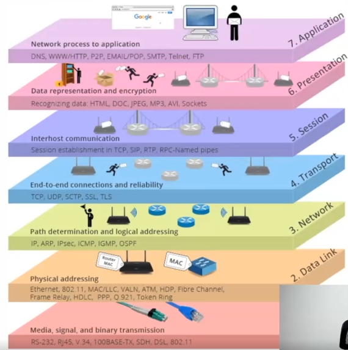
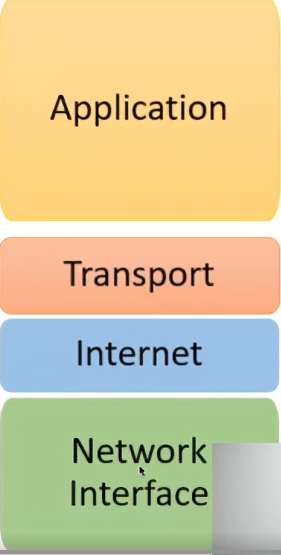
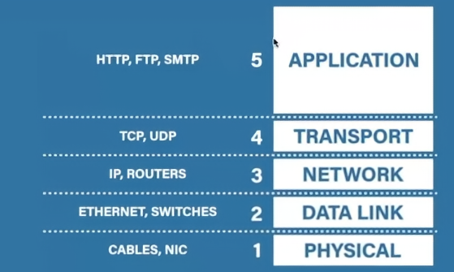
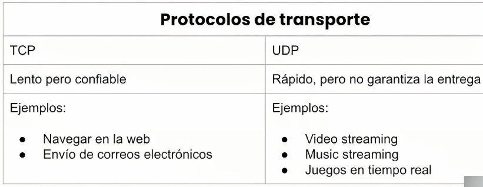
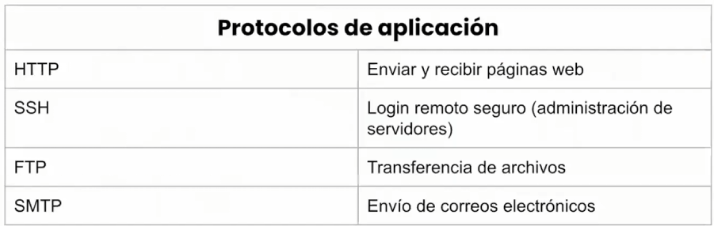
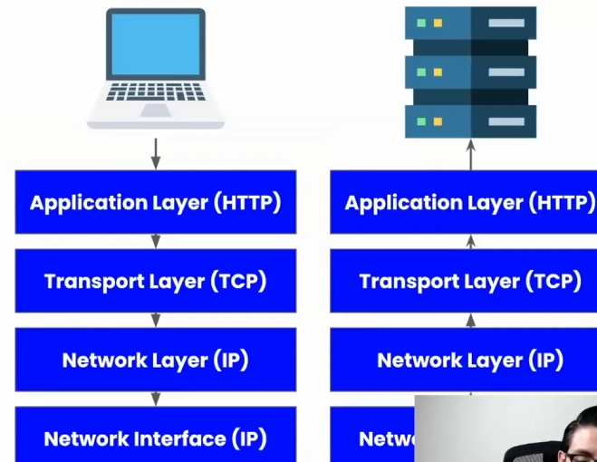
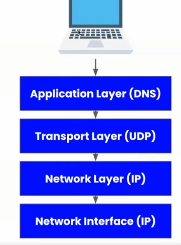

# Fundamentos de red para el backend
## Cómo funciona la web
Se entiende la web como el navegar en internet, el descargar datos, el conectarse a un servidor desde una app, ... Porque la web es una parte del internet.

La web funciona en una arquitectura llamada __cliente-servidor__, esta hace referencia a un modelo en el que tenemos una computacodra central a la que otras computadoras se conectan para obtener la información almacenada en esta computadora central. Para comunicar las computadoras clientes con la computadora sevidor utilizamos la red como medio de transporte.

Estas computadoras intercambian paquetes de información entre dos direcciones. A esto lo llamados el __protocolo TCP/IP__. Los mensajes que se envían entre el cliente y el servidor usan el __protocolo HTTP__ para estructurarse. 

El concepto de la arquitectura cliente-servidor describe el modelo de red en el que varias computadoras se comunican entre sí, en este modelo tenemos dos actores principales: el cliente y el servidor. Estos conceptos no representan un equipo en sí, sino una entidad en la red, donde el servidor pueden ser muchas computadoras, y los clientes también pueden ser muchos. 

El objetivo de este modelo es separar las responsabilidades de cómputo entre el servidor y el cliente, por lo que cada computadora podrá ejecutar programas distintos para la operación del negocio.

El servidor actúa como un provedor de servicios, y podemos decir que comparte sus recursos de cómputo con los clientes. Los clienten consumen estos servicios y no comparten su capacidad de cómputo con el servidor.

En esta arquitectura, la comunicación se da utilizando un patrón de intercambio de mensajes llamado _"request-response"_, solicitud-respuesta, donde una computadora(cliente) solicita información y la otra (servidor) responde. El cleinte __siempre__ inicia la solicitud y debe esperar la respuesta del servidor.

Entonces, para que la arquitectura pueda operar bien, se deben establecer reglas para la comunicación, transporte, codificación del mensaje, información que debe enviarse y que debe recibirse entre otros. Para cumplir todos estos requisitos se utlizan protocolos de red, en el caso de la web se usa el modelo _TCP/IP_ y el modelo de comunicación es el _HTTP_.

## Qué es un protocolo de red
Un protocolo es un conjunto de reglas y normas preestablecidas, en el caso de los protocolos de red, sirven para transmitir datos entre dos dispositivos. Para lograrlo, la complejidad de transferecnia de datos se divide en funciones pequeñas y específicas, que suceden en los distitntos niveles de operación de la red. Cada una de estas funciones puede estar resuelta por un protocolo, por lo que podemos concluir que en la comunicación y transferencia de datos entre dispositivos intervienen muchos protocolos distintos.

Escencialmente lo que los protocolos buscan determinar es:
- Cómo estructurar los datos.
- Formato de los datos.
- Qué información enviar.
- Qué hacer en caso de error.

Estos protocolos trabajan en colaboración, como en una fábrica en donde cada protocolo recibe datos, los procesa y los pasa al siguiente protocolo, así hasta llegar a su destino.

## Modelo OSI
Para evitar el caos entre tanto protocolo, se crean modelos conceptuales que ayudan a la organización de los protocolos dependiendo de la tarea que resuelven.

El primer modelo es el __modelo OSI__ que establece un _framework_ o marco de trabajo de 7 capas en el que se puedan organizar los distintos protocolos de red.

Las capas del modelo OSI:

- Capa física
- Capa de enlace de datos (Data Link)
- Capa de red
- Capa de transporte
- Capa de sesión
- Capa de presentación
- Capa de aplicación

El objetivo del modelo OSI es establecer un marco de comunicación y referencia, con el cuál se puedan discutir soluciones y problemas de red, separando la complejidad en 7 distintas capas.

## Modelo TCP/IP
Este modelo también agrupa distintos protocolos y se utiliza para establecer comunicación entre dos dispositivos a través del internet. Se organiza en 5 capas.
- Capa física
- Capa de enlace de datos (data link)
- Capa de red
- Capa de transporte
- Capa de aplicación

Las capas de sesión, presentación y aplicación del modelo OSI se agrupan en la capa de aplicación del modelo TCP/IP. En algunas referencias, las capas de enlace de datos y física de agrupan en una: la capa de interfaz de red.

Cada una de estas capas establece responsabilidades distintas necesarias para que la comunicación en el internet sea posible y funcional. 

Ahondando en las capas:
- La capa física hace referencia al médio físico con el cual se moverá la información, cables ethenet, fibra óptica, ... 
- La capa data link es una intermediaria entre la física y de red, se encarga de procesar los paquetes de datos de las capas superiores y transformarlos en bits para que puedan transmitirse por la capa física. (análogo a digital)
- La capa de red. Establece el camino entre dispositivos, así como transformar los datos que vienen de capas superiores en paquetes más pequeños. Los protocolos de la capa de red no incluye los mensajes de confirmación de llegada. Solo los envían
- La capa de transporte: Supervisa el camino de la información; Confirma si el paquete fue recibido o no; Recibir los paquetes y a partir de estos recuperar el mensaje original. Mantener la conexión abierta. 
- La capa de aplicación. Es el enlace con la aplicación con la que interactúa el usuario y establece el mensaje para pasar a la capa de transporte. Antes de esta capa, importa un carajo que se está mandando es solo información, es en esta capa donde toma sentido la información enviada. 

En internet se transfieren muchos mensajes con distintos propósitos que son posibles gracias a que existen más de un protocolo de aplicación. Para enviar dicha información se utilizarán uno de dos principales protocolos de transportte, TCP y UDP quienes se encargan de supervisar el envío y comunicación a ambos dispositivos. El protocolo IP es el protocolo encargado de que el mensaje pase de un lado a otro hasta llegar al destinatario y para hacerlo usa direcciones IP.

Un mensaje producido por la capa de aplicación no se envía en un solo grupo, se envía por partes. Cada parte llega al destinatario con el protocolo IP y el protocolo de transporte reúne las partes para volver a formar el mensaje.

La web es sólo una aplicación de internet, también podemos enviar correos, conectar servidores y para cada aplicación se usa un protocolo distinto.

El protocolo para la web es el protocolo HTTP, el que establece cómo se deberá formular una solicitud a un servidor, que luego será enviada usando el protocolo TCP, usando una dirección IP hasta llegar al servidor. Eventualmento, el servidor podra responder con otro mensaje HTTP que será devuelto usando la misma conexión TCP, con la IP del cliente y llegará hasta tu el navegador para que este la interprete. 

Los protocolos de la capa de aplicación "interactuan con el usuario", esto entre comillas ya que no es directo, sino a través de un software, como lo puede ser un navegadore web, chrome, safari, firefoz, opera, ...

Otro protocolo clave de la web en la capa de aplicación es el __protocolo DNS__, muy similar a las capas del protocllo HTTP excepto la capa de aplicación, la arquitectura request-response en la misma. 

La web requiereque :Usemos el protocolo DNS para obtener una IP; Usar esta IP para identificada para enviar otra petición pero ahora usando el protocolo HTTP.

## Protocolo HTTP